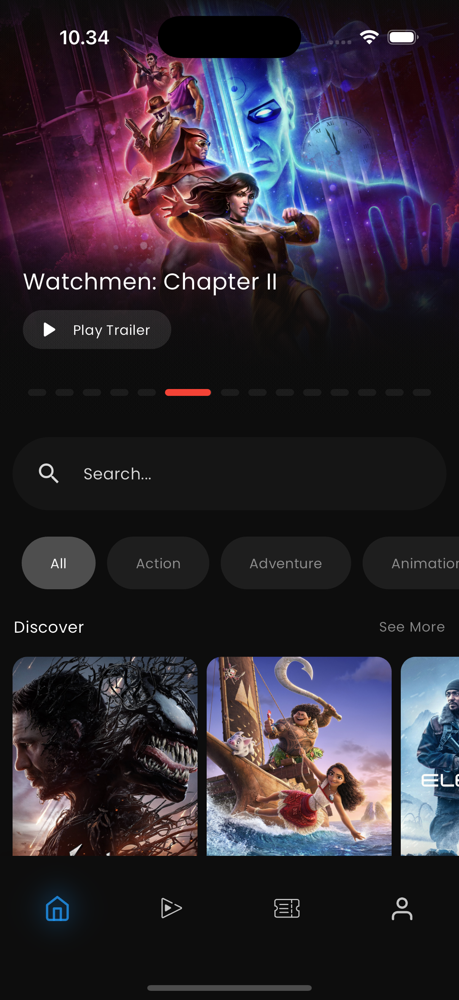
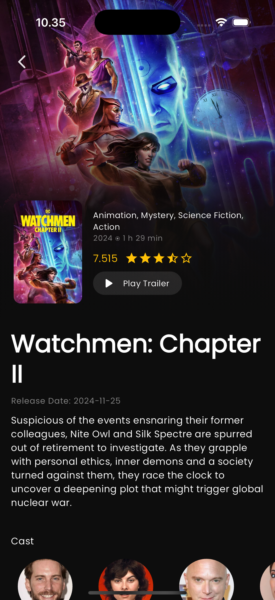
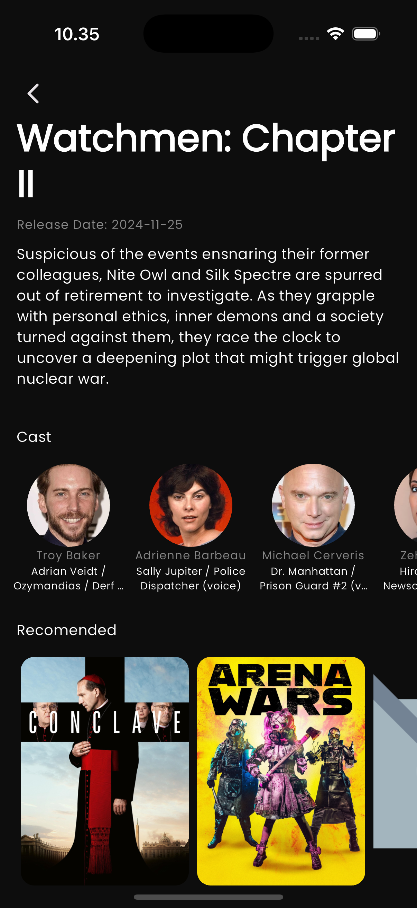
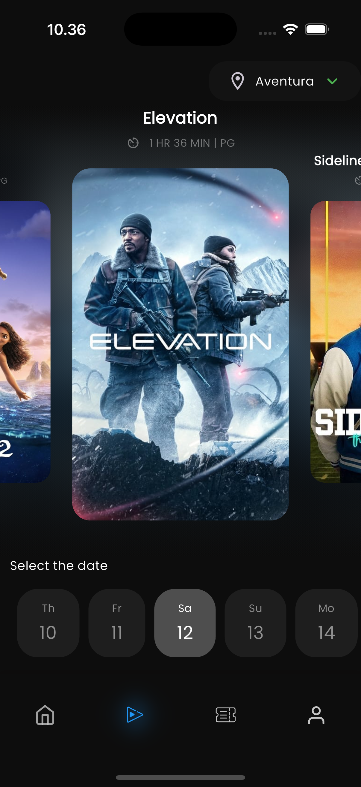
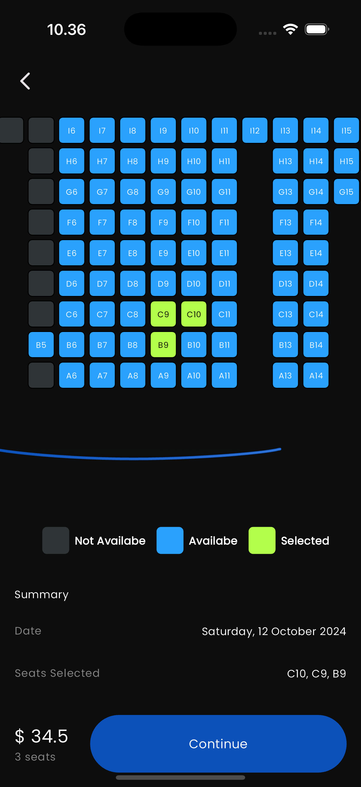
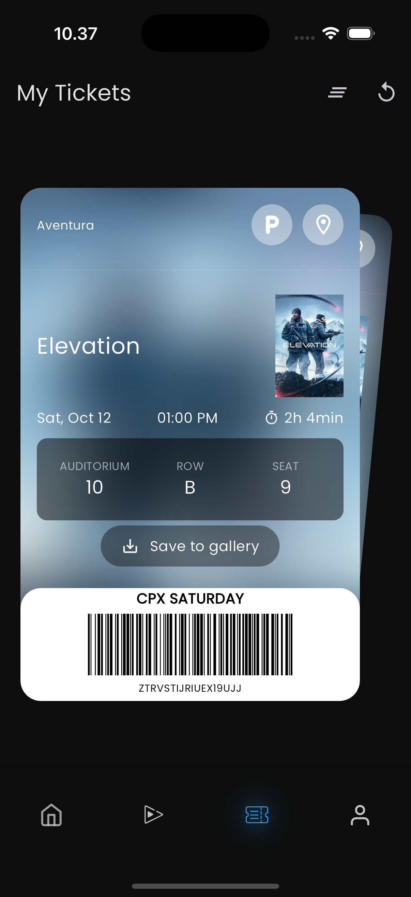
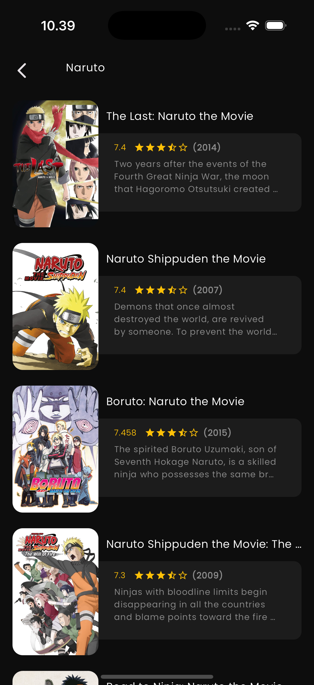
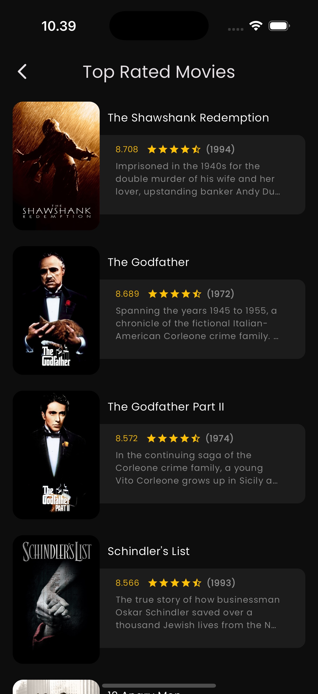

<p align="center">
    
    
    
    
</p>

# Flutter Movie Ticket

**Flutter Movie Ticket** is a Flutter-based application designed to simulate the experience of browsing and selecting movie tickets. The app allows users to explore the latest movies based on popularity, genre, or ratings, with real-time data fetched directly from TMDB (The Movie Database). Users can easily discover their favorite films through a search feature that provides detailed information, such as synopses, release dates, genres, and ratings. With a modern and interactive interface, the app offers an enjoyable experience while exploring its movie catalog.

Although the app does not support direct ticket booking, **Flutter Movie Ticket** aims to deliver a realistic simulation of the movie-ticketing experience. Leveraging cutting-edge technologies like **Dio** for API data fetching and **Riverpod** for state management, the app serves as both an educational platform and an entertaining tool. It is perfect for users who want to explore the latest films or developers seeking inspiration to build Flutter-based applications with real-time data.

<a href="https://github.com/sh4dowByte/flutter_movie_ticket/releases/download/v1.0.0%2B1-2/app-release.apk">
    
</a>

## 🎨 Design

The design of this application is based on the provided Figma file. The slicing process was carried out meticulously to ensure the application accurately represents the design.

## 🚀 Features

- **Seamless Navigation**: Enjoy smooth navigation between screens using Flutter's Navigator for an intuitive user experience.
- **Reusable Components**: Designed with modular and reusable components to ensure maintainable and scalable development.
- **Movie Search**: Quickly find your favorite movies with a powerful search feature that fetches real-time data from TMDB API.
- **Popular Movies**: Explore the latest and trending movies through a dedicated section that showcases popular films based on real-time data.
- **Ticket Booking Simulation**: Simulate the movie ticket booking process with an interactive and user-friendly interface, offering a realistic yet educational experience.

## 🛠️ Technologies

This project is built using the following technologies:

- **[Flutter](https://flutter.dev/)**: A framework for cross-platform application development.
- **[Dart](https://dart.dev/)**: The primary programming language for Flutter.
- **[Riverpod](https://riverpod.dev/)**: A state management solution for efficient and scalable application development.
- **[Dio](https://pub.dev/packages/dio)**: A powerful HTTP client for handling network requests.
- **[Json_annotation](https://pub.dev/packages/json_annotation)**: Used for annotating classes to serialize and deserialize JSON data.
- **[Freezed_annotation](https://pub.dev/packages/freezed_annotation)**: For generating immutable classes and union types in Dart.
- **[Json_serializable](https://pub.dev/packages/json_serializable)**: Simplifies JSON serialization logic with generated code.
- **[Skeleton](https://pub.dev/packages/skeleton)**: Provides placeholder loading effects for a better user experience.
- **[Build_runner](https://pub.dev/packages/build_runner)**: A tool for generating code, including JSON serializers, Freezed classes, and more.
- **[Google Fonts](https://fonts.google.com/)**: For custom font integration.
- **[Figma](https://www.figma.com/)**: Used as the application's design reference.

## 📂 Folder Structure

```plaintext
.
├── assets/                  # Contains images, icons, and other assets  
├── lib/  
│   ├── core/                # Core utilities, constants, and shared functionalities  
│   │   ├── exceptions/      # Custom exceptions  
│   │   └── routes.dart      # Application routes configuration 
│   ├── features/  
│   │   ├── movie/           # Movie feature  
│   │   │   ├── data/  
│   │   │   │   ├── models/  # Data models for movies  
│   │   │   │   └── services/ # API services or repositories for movies  
│   │   │   ├── providers/   # State management for movies  
│   │   │   ├── presentation/  
│   │   │   │   ├── screens/ # Screens for movie feature  
│   │   │   │   └── widgets/ # Reusable widgets for movie screens  
│   │   ├── ticket/          # Ticket feature (similar structure as movie)  
│   │   │   ├── data/  
│   │   │   │   ├── models/  
│   │   │   │   └── services/  
│   │   │   ├── providers/  
│   │   │   ├── presentation/  
│   │   │   │   ├── screens/  
│   │   │   │   └── widgets/  
│   ├── screens/             # General app screens outside specific features  
│   ├── widgets/             # Reusable components across the application  
│   └── main.dart            # Main application entry point  
└── pubspec.yaml             # Flutter project configuration  

```

## 🖼️ Screenshot

|  |  |  |
| ---------------------------------------------- | ---------------------------------------------- | ---------------------------------------------- |
|  |  |  |
|  |  |                                                |

## License

This project is licensed under the Creative Commons Attribution-NonCommercial 4.0 International (CC BY-NC 4.0).
You are free to use this project for personal or educational purposes, but commercial use is not allowed.

For more details, refer to the [full license text](LICENSE).

## Disclaimer

The design of this application is based on a free Figma template available in the Figma Community, originally created by **[Yalie Uzcategui]**. All rights to the original design are retained by the respective creator. This implementation is intended solely for educational and non-commercial purposes.

This project utilizes a design sourced from the Figma Community, created by **[Yalie Uzcategui]**. Licensing terms of the original design may apply. Please review the original Figma design [here](https://www.figma.com/community/file/1389799043219043260) to ensure compliance with its terms before utilizing this project in any capacity.
